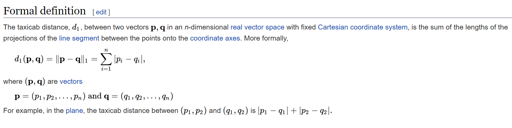

# Entelect Challenge
* Saturday 4th August
* 8:30-15:00
* Can view the problem when released [here](https://challenge.entelect.co.za)
* Online challenge, can compete from anywhere

Register [here](https://challenge.entelect.co.za/portal)

## Team Name: TBD
## Team Members:
* [Fergus Strangways-Dixon](https://github.com/fergusdixon)
* [Joshua Benjamin](https://github.com/joshbenjamin)
* [Angus Mackenzie](https://github.com/AngusTheMack)

## Practice Problem
*The practice problem should be used by each team to get a feel for the problem
solving involved in the official challenge. Although the below problem seems trivial, it
can become an optimization problem with large data sets.*

You are given a map with resource mines denoted by an uppercase alphabetical character. Each mine has an associated depo where resources must be delivered to – these are denoted by the corresponding lowercase alphabetical character.

You are given a number of worker units specified by worker_count which can collect one resource at a time from a mine and deliver it to a depo. A worker unit can carry only one resource at a time. Workers start at position 0, 0 which is the bottom left of the map.

Write an algorithm to visit each mine and deliver the resource to its associated depo whilst minimizing distance travelled.

Your score is calculated by the total distance travelled by all workers. You need to minimize this value.

Distance is calculated using the [Manhattan distance formula](https://en.wikipedia.org/wiki/Taxicab_geometry). Also known as *taxicab geometry* - shown below:

**Constraints**
* 0 < map_width < 100000
* 0 < map_height < 100000
* 0 < worker_count < 10000

## Example I/O
### Example 1 Input
```
1
###b#
#####
##A##
a####
##B##
```
The first line indicates the number of worker units.

The following lines represent the map.
**Uppercase** characters are mines.
**Lowercase** characters are depos for the associated mines.

**Example 1 Output**
```
A,a,B,b
```
Each line consists of the instructions for a single worker. In this case the 1 worker
visited mine A, then depo a, then mind B, then depo b. 

The total Manhattan distance travelled is 15, and the total score is 15.

### Example 2 Input
```
2
###b#
#####
##A##
a####
##B##
```
**Example 2 Output**
```
A,a
B,b
```
Each line consists of the instructions for a single worker. In this case there are 2 workers. Worker 1 visited mine A, then depo a. Worker 2 visited mine B, then depo b.

The total Manhattan distance travelled is 14, and the total score is 14.

## Questions / Queries
Email: challenge@entelect.co.za
Forum [https://forum.entelect.co.za](https://forum.entelect.co.za)

## How To 